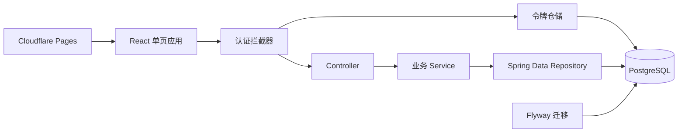

# 学生管理系统架构文档

## 1. 系统目标与范围

建设一个包含前端、后端、数据库和汇报 PPT 的学生管理系统。后端与数据库核心模块已完成，当前进入前端纵向功能开发。

本系统只服务一所学校，不设计多学校数据隔离。后端已覆盖学生档案、班级、课程、成绩、考勤、统计和用户权限，前端按模块逐步接入。

## 2. 当前架构

- 后端：Java 21、Spring Boot 4.0.7、Spring MVC、Spring Data JPA、Bean Validation
- 前端：React 19、TypeScript、Vite、React Router、Lucide React
- 认证：BCrypt 密码哈希、数据库持久化随机会话令牌
- 数据库：PostgreSQL 17
- 数据库版本管理：Flyway
- 自动化测试：JUnit、MockMvc、H2 PostgreSQL 兼容模式
- 本地基础设施：Docker Compose
- 前端联调：可配置 CORS、公共数据库健康检查
- 前端托管目标：Cloudflare Pages 静态站点；后端与数据库独立部署

## 3. 代码结构

- `backend/src/main/java/.../student/`：学生模块的接口、业务和持久化代码
- `backend/src/main/java/.../auth/`：账号、角色、登录和令牌
- `backend/src/main/java/.../schoolclass/`：班级、班主任与学生分班历史管理
- `backend/src/main/java/.../course/`：全校课程目录与开课安排管理
- `backend/src/main/java/.../grade/`：学生成绩录入、修改、查询与实时统计
- `backend/src/main/java/.../attendance/`：课堂场次、学生考勤管理与实时统计
- `backend/src/main/java/.../common/`：跨模块通用能力，例如统一错误响应
- `backend/src/main/resources/db/migration/`：通用 SQL 数据库迁移
- `backend/src/main/java/db/migration/`：需要按数据库类型执行的 Java 数据库迁移
- `backend/src/test/`：集成测试
- `frontend/src/`：前端路由、页面、API 客户端和样式
- `frontend/public/_redirects`：Cloudflare Pages 单页路由回退
- `compose.yaml`：本地 PostgreSQL

## 4. 数据架构

当前核心表包括学生 `students`、班级 `school_classes`、学生分班历史 `student_class_assignments`、课程目录 `courses`、开课安排 `course_offerings`、成绩 `grades`、课堂场次 `attendance_sessions`、考勤记录 `attendance_records`、账号 `user_accounts` 和登录令牌 `auth_tokens`。学号、课程编号与用户名分别唯一；数据库结构只能通过新增 Flyway 迁移变更，不直接修改已执行的迁移。

学生学号由系统生成，格式为 `入学年份 + 8 位数据库主键序号`。学号创建后不可修改，依赖数据库主键保证并发新增时唯一。

## 5. 关键决策

### ADR-001：采用模块化单体

项目现阶段规模较小，采用单个 Spring Boot 应用，按业务模块组织代码。这样便于学习、开发、测试和后续拆分。

### ADR-002：采用 PostgreSQL 与 Flyway

PostgreSQL 作为实际运行数据库；Flyway 保证数据库结构可追踪、可重复部署。

### ADR-003：先做纵向小功能

每次完成一个可调用、可测试、可记录的小功能，同时更新相关文档，避免先搭建大量未验证结构。

### ADR-004：系统只服务一所学校

所有业务数据默认属于同一所学校，核心业务表不增加 `school_id`。如果未来改为多学校系统，需要单独设计数据隔离迁移。

### ADR-005：采用三个固定角色

- 管理员 `ADMIN`：管理所有数据。
- 教师 `TEACHER`：查询学生，后续管理成绩与考勤。
- 学生 `STUDENT`：登录后仅查看自己的信息。

每个账号当前只有一个角色。学生账号必须关联一条学生档案。

### ADR-006：采用数据库会话令牌

登录成功返回高强度随机令牌，数据库只保存令牌的 SHA-256 哈希和过期时间。密码只保存 BCrypt 哈希。默认令牌有效期为 8 小时。

### ADR-007：学号由系统生成且不可修改

新增学生时不接收学号。系统使用入学年份和数据库主键生成学号，例如 `202600000123`；未填写入学日期时使用创建年份。修改入学日期不会重算学号。

### ADR-008：班级记录入学年份与班主任

班级由“入学年份 + 班级名称”唯一标识，并必须关联一个已启用的教师账号作为班主任。同一教师可以担任多个班级的班主任。

### ADR-009：学生可无班级且分班保留历史

学生不必须始终归属班级。入班、转班和离班使用带起止日期的分班历史记录表示；转班或离班只结束当前记录，不删除历史。

### ADR-010：课程目录与开课安排分离

课程目录只记录课程编号、名称、学分和状态。课程编号由系统生成，格式为 `C` 加 8 位数据库主键序号。授课教师、上课班级和学期由开课安排模块记录。

### ADR-011：开课安排按班级和学年学期记录

开课安排关联课程、班级、授课教师、学年起始年份与学期。同一班级在同一学年学期不能重复安排同一课程；仅启用课程和已启用教师可用于新开课安排。

### ADR-012：学生课程表根据分班历史计算

学生课程表不单独保存数据，而是根据指定学期日期范围内的分班历史和对应班级开课安排实时计算。第一学期为学年起始年份 9 月 1 日至次年 1 月 31 日，第二学期为次年 2 月 1 日至 7 月 31 日。

### ADR-013：分班历史使用双层重叠保护

分班写入先锁定学生记录并校验完整历史，避免并发请求产生重叠。PostgreSQL 使用 `btree_gist` 和日期范围排他约束，防止直接 SQL 或其他写入路径绕过业务校验。H2 测试环境不支持该 PostgreSQL 专属约束，由服务层测试覆盖规则。

### ADR-014：成绩关联学生与开课安排

成绩使用百分制，关联学生和具体开课安排。同一学生对同一开课安排最多一条成绩；学生必须在该学期内归属过开课班级。管理员可管理全部成绩，授课教师只管理自己负责的开课安排，学生只查看本人。

### ADR-015：考勤按课堂场次记录

考勤分为课堂场次与学生考勤记录。课堂场次关联开课安排和日期，同一开课安排同一天首版只允许一个场次。学生考勤状态包括出勤、迟到、请假和缺勤，登记时必须校验学生在课堂日期当天归属开课班级。

### ADR-016：成绩统计实时计算

教学班成绩统计和学生学期成绩汇总基于现有成绩、开课安排和课程学分实时计算，不保存统计快照。及格线固定为 60 分；学生学期平均分按课程学分加权。管理员可查看全部统计，授课教师只查看自己教学班统计，学生只查看本人学期汇总。

### ADR-017：考勤统计以已登记记录实时计算

教学班考勤统计和学生学期考勤汇总基于课堂场次、已登记考勤记录和开课安排实时计算，不保存统计快照。出勤率以已登记记录为分母，出勤和迟到计入出勤；未登记学生首版不自动视为缺勤。管理员可查看全部统计，授课教师只查看自己教学班统计，学生只查看本人学期汇总。

### ADR-018：前端联调使用可配置 CORS

后端允许来源通过 `CORS_ALLOWED_ORIGINS` 配置，默认支持本地 Vite 与常见前端开发端口。浏览器预检请求无需认证，实际受保护业务请求仍必须携带 Bearer Token。

### ADR-019：健康检查包含数据库连通性

`GET /api/health` 作为公共运行检查接口，执行轻量数据库查询并返回服务与数据库状态。用户主动退出时只删除当前令牌，不影响同账号其他登录会话。

### ADR-020：成绩与考勤写入按学生串行化

成绩和考勤均采用录入或修改语义。写入前使用数据库悲观写锁锁定学生记录，使同一学生的并发首次写入串行执行：首个请求创建记录，后续请求读取已有记录并更新。数据库唯一约束继续作为最终保障，不同学生的写入不相互阻塞。

### ADR-021：统计使用数据库聚合投影

成绩与考勤统计由数据库执行数量、平均值、极值、求和和条件计数，并通过 Spring Data JPA 聚合投影返回原始统计值。Service 只处理权限、空值归一化、比例和舍入，不加载完整成绩或考勤实体集合。

### ADR-022：过期登录令牌定期清理

过期登录令牌使用数据库条件删除清理，不加载令牌实体。系统默认每小时执行一次定期清理，管理员也可通过受保护接口立即执行并获取删除数量。清理只影响已过期令牌，不撤销有效会话。

### ADR-023：前端采用静态单页应用

前端采用 React、TypeScript 与 Vite，使用 React Router 管理页面路由。构建产物为静态文件，可托管到 Cloudflare Pages；API 地址通过 `VITE_API_BASE_URL` 在构建时配置。

### ADR-024：班级花名册由当前分班记录计算

班级花名册不单独保存数据，只查询结束日期为空的当前分班记录。启用教师列表仅管理员可查询，用于创建班级和后续教学业务选择教师。

## 6. 运行与部署

- 开发数据库由根目录 `compose.yaml` 启动。
- 后端默认连接 `localhost:5432/student_management`。
- 数据库连接可通过 `DB_URL`、`DB_USERNAME`、`DB_PASSWORD` 覆盖。
- 前端计划部署到 Cloudflare Pages；Spring Boot 与 PostgreSQL 的生产托管方案仍待确定。
- 登录、接口令牌校验和学生接口角色授权已实现。
- 管理员可通过受保护接口创建教师账号和学生账号；普通管理员账号仍只允许通过启动配置初始化。
