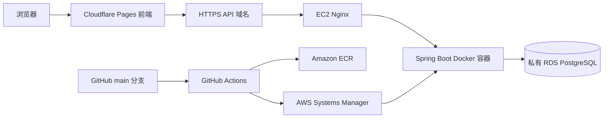

# AWS EC2 后端部署设计

最后更新：2026-06-13

## 目标架构



## 部署决策

- 前端继续由 Cloudflare Pages 托管。
- Spring Boot 后端部署到 EC2 上的 Docker 容器。
- PostgreSQL 使用 RDS，且禁止公网访问。
- Nginx 监听公网 `80/443`，容器仅监听 EC2 回环地址 `127.0.0.1:8000`。
- GitHub Actions 使用 OIDC 临时身份访问 AWS，不保存长期 AWS Access Key。
- GitHub Actions 构建镜像并推送 ECR，再通过 SSM 命令部署到 EC2。
- EC2 不需要长期开放 SSH 端口，日常管理使用 Session Manager。
- 生产数据库密码和初始化管理员密码保存在 EC2 的 `/etc/student-management/backend.env`，权限设为 `600`。

## 网络边界

### EC2 安全组

- 入站 `80/TCP`：`0.0.0.0/0`
- 入站 `443/TCP`：`0.0.0.0/0`
- 不开放 `8080`、`8000` 或 `5432`
- SSH `22` 仅在确有需要时临时对个人 IP 开放

### RDS 安全组

- 入站 `5432/TCP`：来源只能是 EC2 安全组
- `Public access` 必须为 `No`

## 生产环境变量

EC2 上的 `/etc/student-management/backend.env`：

```dotenv
DB_URL=jdbc:postgresql://RDS_ENDPOINT:5432/student_management
DB_USERNAME=student_admin
DB_PASSWORD=REPLACE_WITH_STRONG_DATABASE_PASSWORD
BOOTSTRAP_ADMIN_USERNAME=admin
BOOTSTRAP_ADMIN_PASSWORD=REPLACE_WITH_STRONG_ADMIN_PASSWORD
CORS_ALLOWED_ORIGINS=https://YOUR_PROJECT.pages.dev,https://YOUR_FRONTEND_DOMAIN
AUTH_TOKEN_TTL_HOURS=8
```

环境文件不提交到 Git。首次启动时 Flyway 自动创建或升级数据库结构，系统按环境变量初始化管理员账号。

## 自动部署

`.github/workflows/deploy-backend.yml` 在 `main` 分支的后端或工作流文件发生变化时运行：

1. 执行后端自动化测试。
2. 构建后端 Docker 镜像。
3. 将提交 SHA 标签和 `latest` 标签推送到 ECR。
4. 通过 SSM 在 EC2 上拉取指定 SHA 镜像。
5. 使用生产环境变量文件重建容器。
6. 验证 `/api/health`、Nginx 配置和容器状态。

GitHub 仓库 Variables：

```text
AWS_REGION
AWS_ACCOUNT_ID
ECR_REPOSITORY
EC2_INSTANCE_ID
CONTAINER_NAME
```

GitHub 仓库 Secret：

```text
AWS_ROLE_ARN
```

## 回滚

ECR 保留按 Git 提交 SHA 标记的镜像。需要回滚时，在 EC2 的 Session Manager 中拉取目标 SHA 镜像，并使用与自动部署相同的端口映射和环境文件重建容器。
